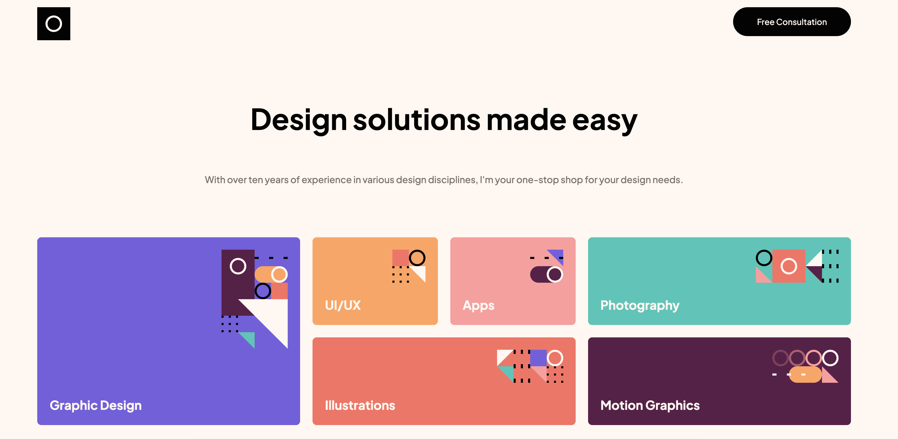

# Frontend Mentor - Single-page design portfolio solution

This is a solution to the [Single-page design portfolio challenge on Frontend Mentor](https://www.frontendmentor.io/challenges/singlepage-design-portfolio-2MMhyhfKVo). Frontend Mentor challenges help you improve your coding skills by building realistic projects.

I often update the code to try out stuff I see in Videos, Tutorials, Blog posts, other Projects, etc. I Link this resources below.

- Aug 2022: Added Swiper Slider to replace the manually created slider.

## Overview

### The challenge

Users should be able to:

- View the optimal layout for the site depending on their device's screen size
- See hover states for all interactive elements on the page
- Navigate the slider using either their mouse/trackpad or keyboard

### Screenshot

### Links

- Solution URL: [Solution URL](https://github.com/felipeavl/single-page-design-portfolio)
- Live Site URL: [Live site URL](https://felipeavl.github.io/single-page-design-portfolio/)

## My process

### Built with

- Semantic HTML5 markup
- CSS custom properties
- Flexbox
- CSS Grid
- [Swiper JS](https://swiperjs.com/)
